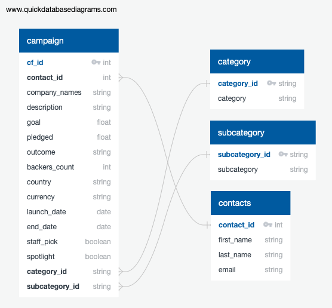

# Crowdfunding ETL Project

## 
Overview
 

This mini-project utilizes partner programming to build an ETL pipeline using Python, Pandas, Python dictionary methods, and regular expressions to extract and transform crowdfunding data. 

The data is then cleaned and output as four CSV files. An entity relationship diagram (ERD) is developed and table schema are defined in order to create a Postres database to load the CSV file data into.

## 
Process
 

### 
EXTRACT
 

- Two excel files are provided containing the raw data in need of manipulating: "crowdfunding" and "contacts."
- Using Pandas, the data are imported into two initial dataframes in order to begin the transformation process.

### 
TRANSFORM
 

- From the crowdfunding data, three Pandas dataframes are created, cleaned, and exported as CSV files: "category," "subcategory," and "campaign."
- From the contacts data, one Pandas dataframe is created, cleaned, and exported as a CSV file: "contacts."

### 
LOAD
 

- After inspecting the CSV files, an ERD of the tables is generated using [QuickDBD](https://www.quickdatabasediagrams.com/).  
<ins>Entity Relationship Diagram</ins>: 
    
- A Postgres database called "crowdfunding_db" is created.
- The four CSV files are loaded into the Postgres database after creating the following tables and defining their schema: "category," "subcategory," "contacts," and "campaign."

## 
Technologies:
 

- [Python 3.10 or higher](https://www.python.org/)
- [Pandas](https://pandas.pydata.org/)
- [NumPy](https://www.numpy.org)
- [PostgreSQL](https://www.postgresql.org/)

## 
Contributors:
 

- [Roxana Darvari](https://github.com/roxanadrv)
- [Brittany Svab](https://github.com/bsvab)
