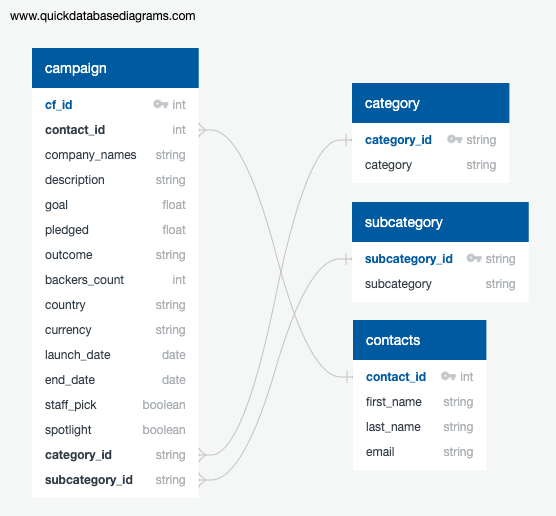

# Crowdfunding ETL Project

## 
Overview
 

The Crowdfunding ETL Project is designed to build an effective ETL (Extract, Transform, Load) pipeline for processing crowdfunding data. The pipeline, developed using Python, Pandas, and regex, extracts data from provided Excel files, transforms it to clean and restructure the dataset, and loads the refined data into a PostgreSQL database. The deliverables of this project are well-defined CSV files and a robustly structured database for subsequent analysis and data handling.

## 
Process
 

### 
EXTRACT
 

The project commences with two primary Excel data sources:

- crowdfunding.xlsx - Contains raw campaign-related data.
- contacts.xlsx - Includes contact details related to the campaigns.

The data from these files is read into separate data frames with Pandas, marking the 
start of the ETL process.
### 
TRANSFORM
 

In the transformation phase, the following steps are executed:

1. Crowdfunding Data:

- The dataset is divided into three distinct data frames: category, subcategory, and - campaign.
- Each data frame undergoes data cleaning to enhance quality and uniformity.
2. Contacts Data:

- Contact information is organized into a single data frame, structured for clarity and accessibility.

The data frames are cleansed, eliminating discrepancies and ensuring usability.

### 
LOAD
 

Post-cleaning, the data is saved into the following CSV files:

1. category.csv
2. subcategory.csv
3. campaign.csv
4. contacts.csv

 After inspecting the CSV files, an ERD of the tables is generated using [QuickDBD](https://www.quickdatabasediagrams.com/). An Entity Relationship Diagram (ERD) is drafted, illustrating the database structure, and the PostgreSQL database is set up with corresponding tables to house the CSV data.

<ins>Entity Relationship Diagram</ins>: 
    

## 
Technologies Used:
 

- [Python 3.10 or higher](https://www.python.org/)
- [Pandas](https://pandas.pydata.org/)
- [NumPy](https://www.numpy.org)
- [PostgreSQL](https://www.postgresql.org/)

## 
Files:

The following files were created during the ETL process:

- campaign.csv: Contains cleaned and structured campaign data.
- category.csv: Lists unique categories with assigned identifiers.
- subcategory.csv: Lists unique subcategories with assigned identifiers.
- contacts.csv: Contains contact information associated with the campaigns.
- ERD_image.png: Visual representation of the database schema.

## 
Instructions for Use:

- Ensure Python 3.10 or higher is installed.
- Install necessary libraries: Pandas, NumPy, and psycopg2 (for PostgreSQL interaction).
- Execute the Jupyter Notebook script to process the Excel files.
- Check the generated CSV files for data consistency.
- Load the CSV files into the PostgreSQL database using the provided schema.
- Utilize the ERD for understanding relationships between tables.

## 
Contributors:
 

- [Roxana Darvari](https://github.com/roxanadrv)
- [Brittany Svab](https://github.com/bsvab)
